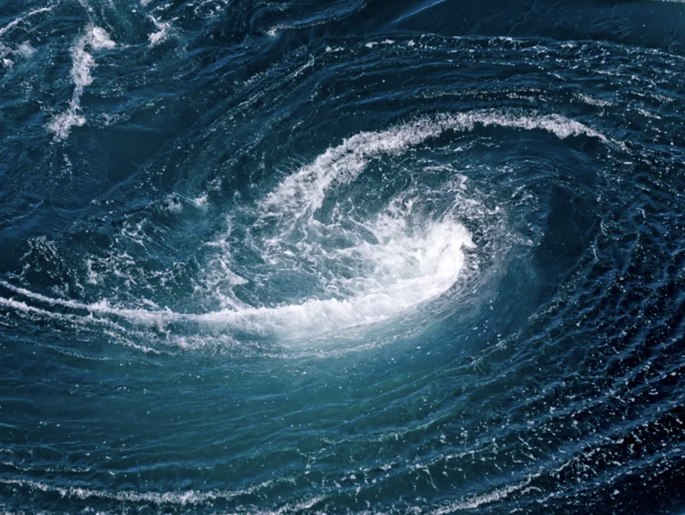
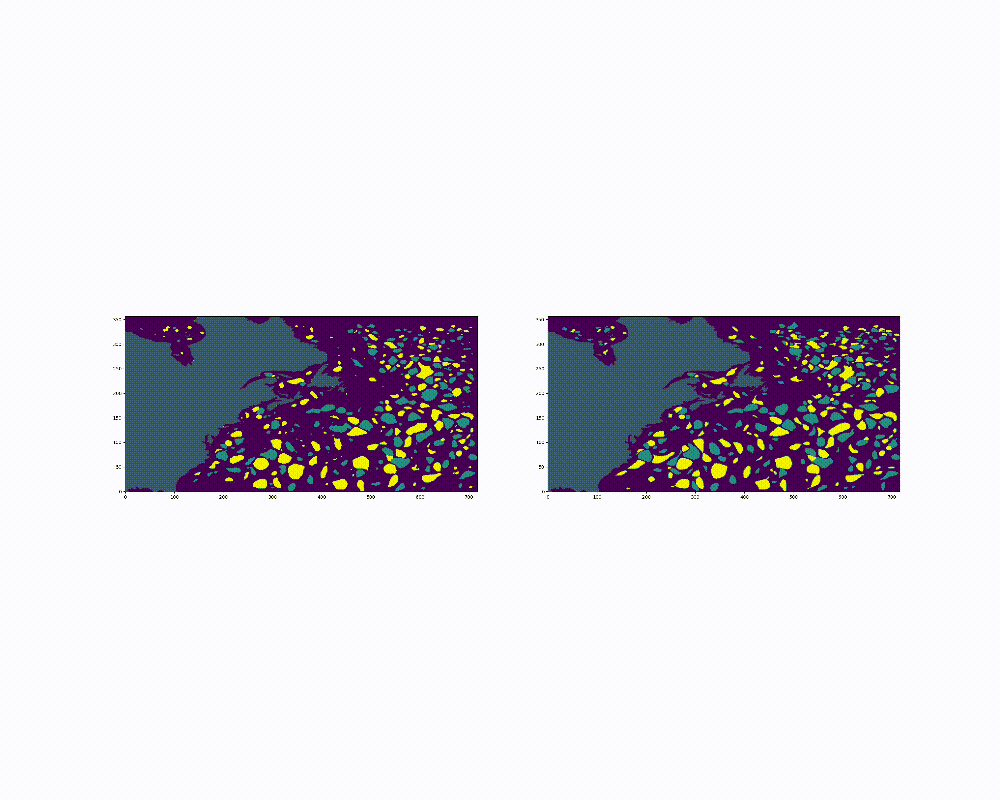
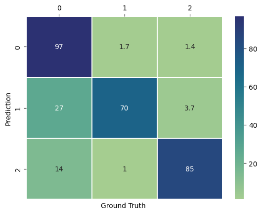

# Eddy forecasting

Oceanic vortices trap and transport physical properties of the environment over long distances. They thus have a major impact on climate evolution. Predicting the movement of vortices requires the use of complex and computationally expensive geophysical models. A new approach involves using a neural network to forecast the evolution of vortices. Inferences from the trained network are immediate and do not require significant computational power

This is a prototype of an oceanic vortex prediction model along the Gulf Stream. The input to the model is altimetric measurements of the sea height over 10 days. The output is the prediction of vortices for the next 10 days.  

*On the left side, the day +10 forecasting, on the right side the ground truth*

The vortices are defined in 3 classes: no vortex, cyclone, and anticyclone."

The network used for training is a U-Net type network. 
### Results 
The confusion matrix of the trained model shows promising results.

* 0 : no eddies
* 1 : cyclones
* 2 : anticyclones

This work stems from a hackathon organized at ISAE SUPAERO for the SDD (Decision Sciences and Data) program.

##### Hackathon organizers

- Daria Botvynko (Mercator Ocean)
- Dennis Wilson (Isae SUPAERO)
- Simon van Gennip (Mercator Ocean)

